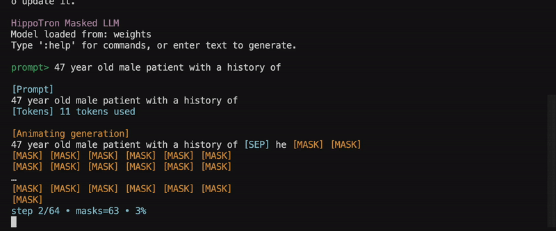

# HippoTron

> Let's find out what happens when you turn a clinical BERT model into a masked diffusion LLM!


**Based on two repos:**
1) [dLLM](https://github.com/ZHZisZZ/dllm)
2) [RoBERTa Diffusion](https://github.com/nathan-barry/RoBERTaDiffusion/tree/main)


**Models:**
- [GatortronS](https://huggingface.co/UFNLP/gatortronS), the 345 million param variant trained primarily on synthetic data
- If that goes well, we can scale to the 8.9 billion param [GatorTron-Large](https://huggingface.co/UFNLP/gatortron-large) to see if it is competitive with the similar sized GatorTronGPT model.

**Data:**
- Diffusion continued-training: [Augmented Clinical Notes](https://huggingface.co/datasets/AGBonnet/augmented-clinical-notes)
- Potential instruction tuning dataset for future exploration:
    - [Asclepius](https://huggingface.co/datasets/starmpcc/Asclepius-Synthetic-Clinical-Notes) (BERT-like QA tasks)
    - [MedAlpaca](https://github.com/kbressem/medAlpaca/tree/main) (for multiple-choice QA eval)





**Setup:**
```
curl -LsSf https://astral.sh/uv/install.sh | sh
uv venv --python 3.11
source .venv/bin/activate
uv pip install -r requirements.txt
```

**Run CLI:**
```
python cli.py --max-new-tokens 64 --animate
```

**Train:**
```
accelerate config
accelerate launch hippotron/train.py
```